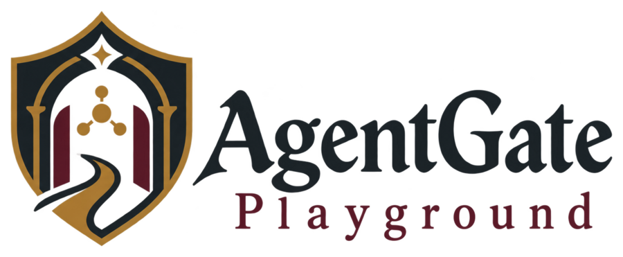
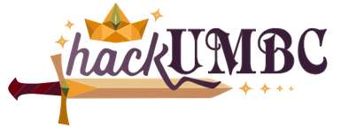

  

# AgentGate Playground

A small sandbox where an AI assistant proposes tool calls and a policy gate decides whether each one runs. All tools are simulated; no real email or file access.

## What it shows

- The assistant reads synthetic club documents and proposes actions: read a document, write a draft, send a draft.
- Each proposal is checked against explicit rules and is **allowed**, **denied**, or **held for human approval**.
- Documents carry a data label (`public`, `internal`, `confidential`), and drafts inherit the highest label read, so sensitive content can't be sent to the wrong people.
- Hidden instructions inside documents can't press the approval button.

## Status

Built on an existing prototype; work during hackUMBC 2026 (September 26–27) is committed here in stages. Setup and run instructions will be added once the app code is in place.

## Presentation materials

- [Slides](https://drive.google.com/file/d/1Wmle25lBTUHrTIq3dQIS7yHTcB2r3Rxr/view?usp=drivesdk), made at hackUMBC 2026
- [Infographic poster](https://drive.google.com/file/d/1ppJHhx0uRkV_1f2pGMt3KwKLJKUoy9Ro/view?usp=drivesdk), made with AI tools
- [Infographic poster, first Canva draft](https://canva.link/x3sukdnx0kvvdy1)

The hackUMBC logo belongs to hackUMBC and is used here only to identify the event.
